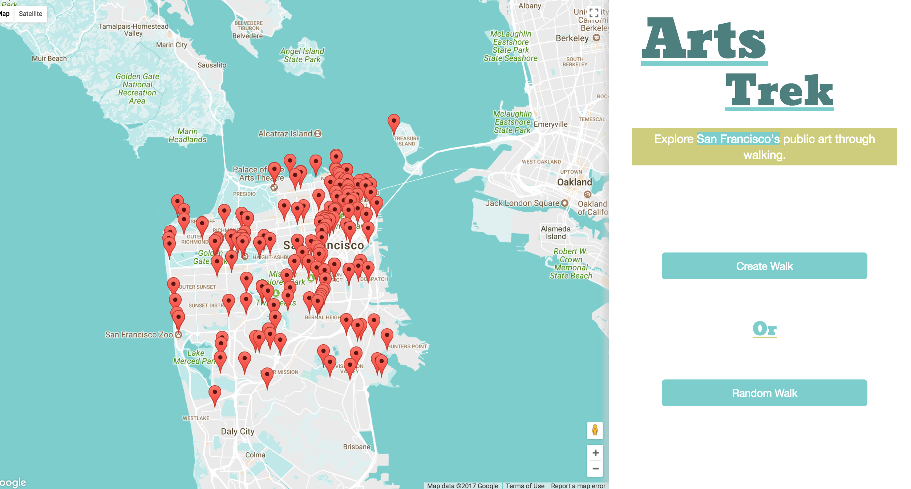

#Stars Trek 

##Description 

    Arts Trek maps locations of public art around San Francisco and presents two options on how to visit them. One option allows the user to click on markers (representing public art) to curate a walk from art piece to art piece. The other option curates the walk for the user, by randomly selecting art pieces to visit. Arts Treks also allows for filtering the markers by the artist's name.

##Tech Stack

- Python 
- Javascript/jQuery
- AJAX/JSON
- Flask-SQLAlchemy 
- PostgresSQL
- Google Maps API 
- SODA API

##Features 

###Create Walk

-Allows for filtering markers by Artist's name.
-Clicking on a marker assigns it as waypoint in the directions.
 
-Clicking "Get Directions" returns directions from the user's current location to the selected markers

###Random Walk

-User can choose the diameter of the polygon generated on the map
-The program "randomly" selects markers within that polygon
-Directions are rendered from the User's current position to the "randomly" selected markers

